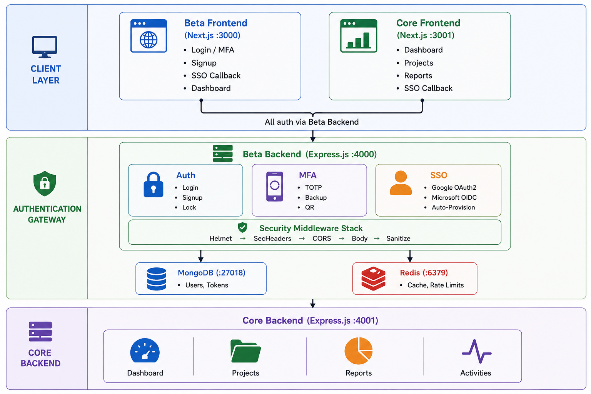

<div align="center">

# AfDB Beta Frontend — Auth Portal

### Live Reference Application — Consultancy Proposal Support

<br/>

| | |
|---|---|
| **Prepared By** | [Eng. Depute N.Alphonse, PMP®](https://atradezone.ca/deputenalphonse) |
| **Role** | Senior Web Frontend Developer Consultant (TCIS) |
| **Live Demo** | [afdb-beta.atradezone.ca](https://afdb-beta.atradezone.ca) |
| **Documentation** | [Technical Docs](https://afdb-beta.atradezone.ca/docs) · [User Manual](https://afdb-beta.atradezone.ca/docs/user-manual.html) |
| **GitHub Org** | [github.com/AfDB-Consultant](https://github.com/AfDB-Consultant) |

<br/>

<a href="https://afdb-beta.atradezone.ca">
  
</a>

<a href="https://afdb-beta.atradezone.ca/docs/user-manual.html">
  
</a>

</div>

---

## About This Application

> Words on a page can say a lot. Code says more.

This is a **live reference application** — deployed, accessible, and open-source — built to demonstrate the exact patterns described in the consultancy proposal for **Senior Web Frontend Developer Consultant (TCIS)** at the African Development Bank.

The system currently comprises **172+ source files** across **4 public repositories** in the [AfDB-Consultant](https://github.com/AfDB-Consultant) GitHub organisation, with all 6 Docker services running and continuously deployed via GitHub Actions.

### What This Repo Does

This is the **Beta Tier Frontend** — the front door of the system. This is where Bank users land. It handles:

- MFA authentication flows with email OTP verification
- OWASP-hardened login, registration, and password reset
- Session management and role-based routing
- Navigation to the Core dashboard for data operations

## Architecture



The reference app is a **two-tier enterprise system**:

| Tier | Role | Repos |
|------|------|-------|
| **Beta Tier** — The Front Door | MFA authentication, OWASP-hardened login, session management, role-based routing | `afdb_beta_frontend` + `afdb_beta_backend` |
| **Core Tier** — The Engine | RESTful APIs, business logic, database management, external integrations | `afdb_core_frontend` + `afdb_core_backend` |

```
┌─────────────────────────────────────────────────────────┐
│                    CLIENT LAYER                          │
│  afdb-beta.atradezone.ca    afdb-core.atradezone.ca     │
│  Beta Frontend (:3000)      Core Frontend (:3001)       │
└──────────────────────┬──────────────────────────────────┘
                       │
┌──────────────────────▼──────────────────────────────────┐
│           AUTHENTICATION GATEWAY                         │
│  afdb-api.atradezone.ca                                  │
│  Beta Backend (:4000)                                    │
│  Auth │ OTP │ MFA │ SSO │ Email Service                 │
│  MongoDB Atlas │ Redis │ SMTP                            │
└──────────────────────┬──────────────────────────────────┘
                       │
┌──────────────────────▼──────────────────────────────────┐
│  afdb-core-api.atradezone.ca                             │
│  Core Backend (:4001)                                    │
│  Dashboard │ Projects │ Reports │ Activities │ Team      │
└──────────────────────────────────────────────────────────┘
```

## Technology Stack

| Layer | Technology |
|-------|-----------|
| **Frontend** | Next.js 15, React 19, TypeScript, Ant Design 5, Tailwind CSS |
| **Backend** | Node.js, Express.js, TypeScript |
| **Database** | MongoDB Atlas (Mongoose ODM) |
| **Cache** | Redis 7 (OTP storage, rate limiting, session cache) |
| **Auth** | JWT (access + refresh), bcrypt, otplib (TOTP), Email OTP |
| **Email** | Nodemailer with professional HTML templates (CID logo) |
| **Security** | Helmet, CORS, Input Sanitizer, Rate Limiter, Security Headers |
| **CI/CD** | GitHub Actions → Docker Hub → AWS EC2 (self-hosted runner) |
| **Containerization** | Docker + Docker Compose + Nginx reverse proxy |

## Key Features

- **Email OTP Verification** — 6-digit codes for login, registration, and password reset
- **Multi-Factor Authentication** — TOTP-based with 10 backup codes
- **OWASP Top 10 Compliance** — Full coverage of A01–A09
- **SSO-IDP Federation** — OAuth2/OIDC with Google and Microsoft Azure AD
- **Role-Based Access Control** — Admin, Manager, Viewer with permission-gated UI
- **Responsive Design** — Desktop and mobile layouts with theme switching
- **Professional Email Templates** — Branded HTML emails with embedded logo
- **API Documentation** — Interactive Scalar API reference

## Live URLs

| Service | URL |
|---------|-----|
| **Auth Portal (Beta Frontend)** | [https://afdb-beta.atradezone.ca](https://afdb-beta.atradezone.ca) |
| **Enterprise Dashboard (Core Frontend)** | [https://afdb-core.atradezone.ca](https://afdb-core.atradezone.ca) |
| **Auth API (Beta Backend)** | [https://afdb-api.atradezone.ca](https://afdb-api.atradezone.ca) |
| **Data API (Core Backend)** | [https://afdb-core-api.atradezone.ca](https://afdb-core-api.atradezone.ca) |
| **API Documentation** | [https://afdb-api.atradezone.ca/api-docs](https://afdb-api.atradezone.ca/api-docs) |
| **User Manual** | [https://afdb-beta.atradezone.ca/docs/user-manual.html](https://afdb-beta.atradezone.ca/docs/user-manual.html) |

## Quick Start

```bash
# Clone the repository
git clone https://github.com/AfDB-Consultant/afdb_beta_frontend.git
cd afdb_beta_frontend

# Install dependencies
npm install

# Start the development server
npm run dev
```

Open [http://localhost:3000](http://localhost:3000)

> **Prerequisites:** Beta Backend running on port 4000, MongoDB, and Redis.

## Demo Credentials

All accounts work on both portals — they share the same authentication backend (Beta).
**Login requires email OTP verification** — after entering credentials, check the user's Yopmail inbox for the 6-digit code.

| Role | Email | Password | Yopmail Inbox |
|------|-------|----------|---------------|
| **Admin** | `afdbadmin@yopmail.com` | `Admin@123` | [yopmail.com/?afdbadmin](https://yopmail.com/en/?afdbadmin) |
| **Viewer** | `afdbaviewer@yopmail.com` | `Viewer@123` | [yopmail.com/?afdbaviewer](https://yopmail.com/en/?afdbaviewer) |
| **Manager** | `afdbmanager@yopmail.com` | `Manager@123` | [yopmail.com/?afdbmanager](https://yopmail.com/en/?afdbmanager) |

## Related Repositories

| Repository | Role | Live URL |
|-----------|------|----------|
| [`afdb_beta_backend`](https://github.com/AfDB-Consultant/afdb_beta_backend) | Authentication Gateway — OTP, MFA, SSO, JWT, Email, OWASP | [afdb-api.atradezone.ca](https://afdb-api.atradezone.ca) |
| [`afdb_core_frontend`](https://github.com/AfDB-Consultant/afdb_core_frontend) | Enterprise Dashboard — Projects, Reports, Team | [afdb-core.atradezone.ca](https://afdb-core.atradezone.ca) |
| [`afdb_core_backend`](https://github.com/AfDB-Consultant/afdb_core_backend) | Data Engine — Project & Dashboard APIs | [afdb-core-api.atradezone.ca](https://afdb-core-api.atradezone.ca) |

## Proposal Reference

This application supports the consultancy proposal for:

**Senior Web Frontend Developer Consultant (TCIS)**
African Development Bank

| Document | Link |
|----------|------|
| **Portfolio** | [atradezone.ca/deputenalphonse](https://atradezone.ca/deputenalphonse) |
| **Curriculum Vitae** | [Canva CV](https://canva.link/wi9a7piqzdscqqg) |
| **Technical Documentation** | [afdb-beta.atradezone.ca/docs](https://afdb-beta.atradezone.ca/docs) |
| **User Manual** | [afdb-beta.atradezone.ca/docs/user-manual.html](https://afdb-beta.atradezone.ca/docs/user-manual.html) |

## Contact

<div>

**Eng. Depute N.Alphonse, PMP®**
*Senior Web Frontend Developer Consultant*

- **Email:** [depute@atradezone.ca](mailto:depute@atradezone.ca)
- **Phone:** +250 782 424 845
- **Location:** Kigali, Rwanda
- **Portfolio:** [atradezone.ca/deputenalphonse](https://atradezone.ca/deputenalphonse)
- **LinkedIn:** [linkedin.com/in/deputenalphonse](https://www.linkedin.com/in/deputenalphonse/)
- **GitHub:** [github.com/deputee](https://github.com/deputee)

</div>

---

<div align="center">

*© 2026 Eng. Depute N.Alphonse, PMP®. Open-source reference application.*

</div>
